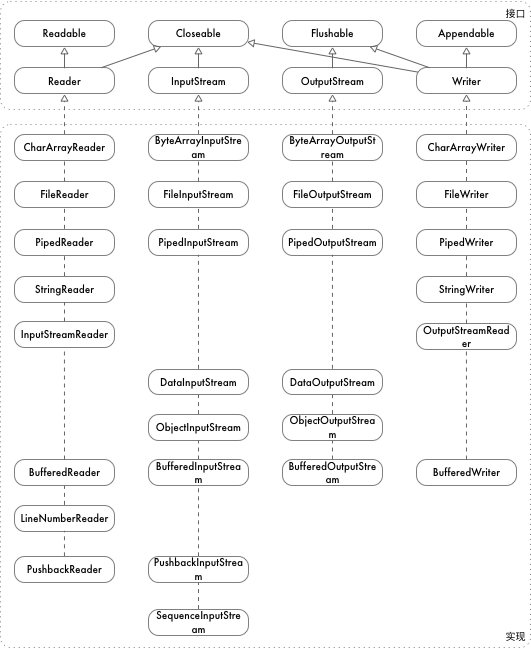

# java io 流

## io 流总览



IO 流主要提供四个接口

- `InputStream`: 输入字节流
- `OutputStream`: 输出字节流
- `Reader`: 输入字符流
- `Writer`: 输出字符流

## InputStream

`InputStream` 输入字节流，关注字节的读取，io 提供如下 InputStream 的实现

- `ByteArrayInputStream`: 通过 byte 数组构建的流
- `FileInputStream`: 文件输入流
- `PipedInputStream`: 管道流，可和其他的 PipedOutStream 连接，通常用于线程间通信
- `DataInputStream`: 二进制数据输入流
- `ObjectInputStream`: 对象输入流
- `BufferedInputStream`: 带缓冲 buffer 的输入流
- `SequenceInputStream`: 能将多个字节流合并成一个
- `PushbackInputStream`: 能回退的字节流

InputStream 提供如下接口:

- `read`: 从流中读取一个字节
- `read(buffer, offset, length)`: 从流中读取 length 个字节，写入到 buffer 的 offset 处，返回真实读取的字节数
- `readNBytes(buffer, offset, length)`: 和 read 一样，但是保证读取 length 个字节，除非流中没有数据
- `readAllBytes`: 读取所有字节，返回一个字节数组
- `skip`: 跳过前 n 个字节
- `available`: 剩余字节数
- `mark`: 标记当前读取的位置
- `reset`: 将流指针重置到上次标记的位置
- `close`: 关闭流，释放资源

``` java
{
    InputStream in = new ByteArrayInputStream("0123456789".getBytes());
    assertEquals(in.read(), '0');
}
{
    InputStream in = new ByteArrayInputStream("0123456789".getBytes());
    byte[] buf = new byte[4];
    assertEquals(in.read(buf), 4);
    assertArrayEquals(buf, "0123".getBytes());
}
{
    InputStream in = new ByteArrayInputStream("0123456789".getBytes());
    byte[] buf = new byte[20];
    assertEquals(in.read(buf), 10);
    assertArrayEquals(Arrays.copyOf(buf, 10), "0123456789".getBytes());
}
{
    InputStream in = new ByteArrayInputStream("0123456789".getBytes());
    byte[] buf = new byte[20];
    assertEquals(in.read(buf, 1, 4), 4);
    assertArrayEquals(Arrays.copyOfRange(buf, 1, 1 + 4), "0123".getBytes());
}
{
    InputStream in = new ByteArrayInputStream("0123456789".getBytes());
    byte[] buf = new byte[20];
    assertEquals(in.readNBytes(buf, 1, 4), 4);
    assertArrayEquals(Arrays.copyOfRange(buf, 1, 1 + 4), "0123".getBytes());
}
{
    InputStream in = new ByteArrayInputStream("0123456789".getBytes());
    assertArrayEquals(in.readAllBytes(), "0123456789".getBytes());
}
{
    InputStream in = new ByteArrayInputStream("0123456789".getBytes());
    assertEquals(in.skip(2), 2);
    assertEquals(in.available(), 8);
    assertEquals(in.read(), '2');
    assertEquals(in.available(), 7);
    in.mark(0);
    assertEquals(in.read(), '3');
    in.reset();
    assertEquals(in.available(), 7);
    assertEquals(in.read(), '3');
    in.close();
}
```

## OutputStream

`OutputStream` 输出字节流，关注字节的写入，io 包提供了如下 OutputStream 的实现

- `ByteArrayOutputStream`: 输出 byte 数组
- `FileOutputStream`: 文件输出流
- `PipedOutputStream`: 管道流，可和其他的 PipedInputStream 连接，通常用于线程间通信
- `DataOutputStream`: 二进制数据输出流
- `ObjectOutputStream`: 对象输出流
- `BufferedOutputStream`: 带缓冲 buffer 的输出流
- `SequenceOutputStream`: 能将多个输出流合并成一个

OutputStream 提供如下接口:

- `write`: 写入一个字节
- `write(buffer)`: 写入 buffer 中的数据
- `write(buffer, offset, length)`: 写入 buffer 从 offset 起的 length 个字节的数据
- `flush`: 将缓冲区的数据刷到实际的存储中
- `close`: 关闭流

``` java
OutputStream out = new ByteArrayOutputStream();
out.write('0');
out.write("123456789".getBytes());
out.write("0123456789".getBytes(), 1, 2);
out.flush();
out.close();
```

## Reader

## Writer

## 链接

- 测试代码: <https://github.com/hatlonely/hellojava/blob/master/src/test/java/util/IOTest.java>
