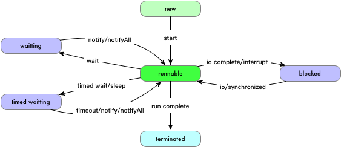

# java 线程

## 简介

Thread 提供如下方法:

- `getId`: 获取线程 id
- `getName`: 获取线程名称
- `getPriority`: 获取优先级
- `getState`: 获取当前线程状态
- `isAlive`: 线程是否还活着
- `isDaemon`: 是否是后台线程
- `isInterrupted`: 是否处于中断状态
- `getThreadGroup`: 线程组
- `getContextClassLoader`: 获取类加载器
- `getUncaughtExceptionHandler`: 获取异常处理句柄

``` java
Thread t = Thread.currentThread();
System.out.println("id: " + t.getId());
System.out.println("name: " + t.getName());
System.out.println("priority: " + t.getPriority());
System.out.println("state: " + t.getState());
System.out.println("isAlive: " + t.isAlive());
System.out.println("isDaemon: " + t.isDaemon());
System.out.println("isInterrupted: " + t.isInterrupted());
System.out.println("threadGroup: " + t.getThreadGroup());
System.out.println("contextClassLoader: " + t.getContextClassLoader());
System.out.println("stackTrace: " + t.getStackTrace());
System.out.println("uncaughtExceptionHandler: " + t.getUncaughtExceptionHandler());
```

线程的生命周期:



## Thread 类

继承 `Thread`，实现自己的 `run` 方法，就可以定义一个线程类，调用 `start` 就可以在一个新的线程里面调用 `run` 方法，如果需要等待线程结束，可以调用 `join` 方法

- `run`: 线程启动后执行的内容
- `start`: 启动线程
- `join`: 阻塞等待线程结束

``` java
class MyThread extends Thread {
    private final String name;

    private MyThread(String name) {
        this.name = name;
    }

    @Override
    public void run() {
        for (int i = 0; i < 5; i++) {
            try {
                Thread.sleep(100);
                System.out.printf("%s is running %d\n", name, i);
            } catch (Exception e) {
                e.printStackTrace();
            }
        }
    }
}

{
    Thread t1 = new MyThread("t1");
    Thread t2 = new MyThread("t2");

    t1.start();
    t2.start();
    try {
        t1.join();
        t2.join();
    } catch (Exception e) {
        e.printStackTrace();
    }
}
```

## Runnable 接口

和 Thread 差不多，只不过不直接继承 Thread，而是实现 Runnable 接口（Runable 只有一个 `run` 方法），使用上面用这个 Runnable 去构造一个 Thread，这种方式相对直接继承 Thread 的方式要更加灵活，因为 java 是单继承，如果继承了 Thread 就不能再继承别的类

事实上，建议不要直接继承 Thread 类，因为从语义上来讲，Thread 也应该也只是方法运行的方式，你的类应该是可以在这种方式下运行，而不是一种 Thread 对象，从这个角度讲，Runnable 提供了更好的语义，用一个 Thread 对象去运行一个 Runable

``` java
class MyRunnable implements Runnable {
    private final String name;

    private MyRunnable(String name) {
        this.name = name;
    }

    @Override
    public void run() {
        for (int i = 0; i < 5; i++) {
            try {
                Thread.sleep(100);
                System.out.printf("%s is running %d\n", name, i);
            } catch (Exception e) {
                e.printStackTrace();
            }
        }
    }
}

{
    Thread r1 = new Thread(new MyRunnable("r1"));
    Thread r2 = new Thread(new MyRunnable("r2"));

    r1.start();
    r2.start();
    try {
        r1.join();
        r2.join();
    } catch (Exception e) {
        e.printStackTrace();
    }
}
```

## Callable 接口

`Runnbale` 是没有返回值的，如果希望获取线程执行结束后的返回值，可以使用 `Callable` 接口，通过 FutureTask 封装 `Callable` 传给线程，后续可以 `FutureTask` 的 `get` 接口获取返回值，还可以设置运行超时时间，超时后抛出一个异常

``` java
class MyCallable implements Callable<Integer> {
    private final Random random;

    private MyCallable() {
        random = new Random();
    }

    @Override
    public Integer call() throws Exception {
        Thread.sleep(100);
        return random.nextInt();
    }
}

{
    FutureTask<Integer> future1 = new FutureTask<>(new MyCallable());
    FutureTask<Integer> future2 = new FutureTask<>(new MyCallable());
    new Thread(future1).start();
    new Thread(future2).start();

    try {
        System.out.println(future1.get(50, TimeUnit.MILLISECONDS));
    } catch (InterruptedException | TimeoutException | ExecutionException e) {
        e.printStackTrace();
    }

    try {
        System.out.println(future2.get());
    } catch (InterruptedException | ExecutionException e) {
        e.printStackTrace();
    }
}
```

## 链接

- 测试代码链接：<https://github.com/hatlonely/hellojava/blob/master/src/test/java/util/ThreadTest.java>
- “implements Runnable” vs. “extends Thread” ：<https://stackoverflow.com/questions/541487/implements-runnable-vs-extends-thread>
