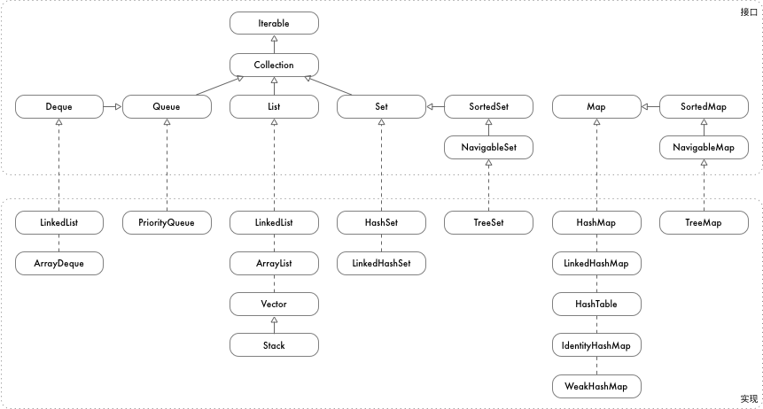

# java 集合

## 数据结构总览



## Collection

Collection 接口主要关注集合的添加，删除，包含

- `isEmpty`: 判断是否没有元素
- `size`: 获取元素个数
- `add`: 添加元素
- `addAll`: 添加给定集合中的所有元素，相当于并集
- `remove`: 删除元素
- `removeAll`: 删除给定集合中的所有元素，相当于差集
- `removeIf`: 删除满足谓词的元素
- `retainAll`: 保留给定集合中的元素，相当于交集
- `contains`: 判断某个元素是否在集合内
- `containsAll`: 判断给定集合中的所有元素是否都在集合内
- `clear`: 清空所有元素
- `stream`: 支持流处理

``` java
{
    Collection<Integer> c = new ArrayList<>(List.of(1, 2, 3, 4, 5));
    assertEquals(c.size(), 5);
    assertFalse(c.isEmpty());
    assertTrue(c.contains(3));
    assertTrue(c.containsAll(List.of(2, 4)));
    c.clear();
    assertEquals(c.size(), 0);
    assertTrue(c.isEmpty());
}
{
    Collection<Integer> c = new ArrayList<>(List.of(1, 2, 3, 4, 5));
    c.add(6);
    assertThat(c, equalTo(List.of(1, 2, 3, 4, 5, 6)));
    c.addAll(List.of(7, 8, 9));
    assertThat(c, equalTo(List.of(1, 2, 3, 4, 5, 6, 7, 8, 9)));
}
{
    Collection<Integer> c = new ArrayList<>(List.of(1, 2, 3, 4, 5));
    c.remove(3);
    assertThat(c, equalTo(List.of(1, 2, 4, 5)));
    c.removeAll(List.of(2, 3));
    assertThat(c, equalTo(List.of(1, 4, 5)));
    c.retainAll(List.of(1, 2, 3, 4));
    assertThat(c, equalTo(List.of(1, 4)));
    c.removeIf(x -> x % 2 == 0);
    assertThat(c, equalTo(List.of(1)));
}
{
    Collection<Integer> c = new ArrayList<>(List.of(1, 2, 3, 4, 5));
    c.forEach(System.out::print);
    assertEquals(c.stream().map(x -> x * x).mapToInt(x -> x).sum(), 55);

    for (Integer i : c) {
        System.out.print(i);
    }
}
```

## List

List 接口为顺序表，继承自 Collection，关注集合的定位，查找，修改和排序，底层有两种实现，链表和数组，链表有较好的头部插入性能，数组在随机访问的时候有很大优势，util 里主要提供了三种顺序表:

- `LinkedList`: 双链表实现，定位元素需要遍历，get 性能是 O(n)；插入性能 O(1)，但指定下标插入需要先定位；查找也需要遍历，性能 O(n)
- `ArrayList`: 数组实现，插入时需要移动数组中的元素，插入性能是 O(n)，向后插入是 O(1)，插入时如果数组空间不够，需要重新申请新的空间，并将原来的元素添加到新的数组中；可以根据下标定位元素，支持随机访问，get 性能是 O(1)；查找需要遍历，性能 O(n)
- `Vector`: 和 `ArrayList` 底层一样，但是是线程安全的

`List` 在 `Collection` 的基础上，提供了下面接口:

- `get`: 按下标定位元素
- `indexOf`: 查找元素，返回下标
- `lastIndexOf`: 从后向前查找元素
- `subList`: 子链表
- `set`: 指定下标修改
- `sort`: 排序
- `replaceAll`: 对所有元素用 UnaryOperator 的返回值替换

``` java
{
    List<Integer> l = new ArrayList<>(List.of(1, 2, 3, 4, 5, 4, 3, 2, 1));
    assertEquals(l.get(2), Integer.valueOf(3));
    assertEquals(l.indexOf(3), 2);
    assertEquals(l.indexOf(6), -1);
    assertEquals(l.lastIndexOf(3), 6);
    assertEquals(l.subList(2, 6), List.of(3, 4, 5, 4));
}
{
    List<Integer> l = new ArrayList<>(List.of(1, 2, 3, 4, 5, 4, 3, 2, 1));
    l.set(5, 6);
    assertThat(l, equalTo(List.of(1, 2, 3, 4, 5, 6, 3, 2, 1)));
}
{
    List<Integer> l = new ArrayList<>(List.of(1, 2, 3, 4, 5, 4, 3, 2, 1));
    l.sort(Integer::compareTo);
    assertThat(l, equalTo(List.of(1, 1, 2, 2, 3, 3, 4, 4, 5)));
}
{
    List<Integer> l = new ArrayList<>(List.of(1, 2, 3, 4, 5, 4, 3, 2, 1));
    l.replaceAll(x -> x * x);
    assertThat(l, equalTo(List.of(1, 4, 9, 16, 25, 16, 9, 4, 1)));
}
```

## Set

`Set` 和 `List` 的本质区别在于可重复性，`Set` 中的元素是不可重复的，`Set` 又分为有序 `Set` 和无序 `Set`，有序 `Set` 中的元素是按顺序排列的，util 中提供了三种实现

- `TreeSet`: 有序 Set，元素必须是可比较的，使用红黑树实现，插入删除查找代价都是 O(lgn)
- `HashSet`: 无序 Set，元素必须是能被 hash 的，使用 hash 表实现，插入删除查找代价都是 O(1)
- `LinkedHashSet`: 无序的 Set，但是提供能插入顺序的遍历，使用 hash + 链表实现，插入删除查找都是 O(1)

`Set` 没有提供 `Collection` 接口之外的接口

同时 `TreeSet` 还实现了 `SortedSet` 和 `NavigableSet`

`SortedSet` 继承自 `Set`，提供了如下接口:

- `first`: 最小的元素
- `last`: 最大的元素
- `headSet`: 头部集合，小于给定元素的元素构成的集合
- `tailSet`: 尾部集合，大于等于给定元素的元素构成的集合
- `subSet`: 子集，[from, to) 集合

``` java
SortedSet<String> set = IntStream.range(0, 10).boxed().map(x -> "key" + x).collect(Collectors.toCollection(TreeSet::new));
assertEquals(set.first(), "key0");
assertEquals(set.last(), "key9");
assertThat(set.headSet("key3"), equalTo(Set.of("key0", "key1", "key2")));
assertThat(set.tailSet("key7"), equalTo(Set.of("key7", "key8", "key9")));
assertThat(set.subSet("key3", "key7"), equalTo(Set.of("key3", "key4", "key5", "key6")));
```

`NavigableSet` 继承自 `SortedSet`，提供了如下接口:

- `lower`: 小于给定值的最大值
- `higher`: 大于给定值的最小值
- `floor`: 小于等于给定值中的最大值
- `ceiling`: 大于等于给定值的最小值
- `pollFirst`: 删除并获取最小值
- `pollLast`: 删除并获取最大值
- `descendingSet`: 获取倒排的集合
- `headSet`: 头部集合，提供额外参数是否包含给定值
- `tailSet`: 尾部集合，提供额外参数是否包含给定值
- `subSet`: 子集，提供额外参数是否包含给定值

``` java
{
    NavigableSet<String> set = IntStream.range(0, 10).boxed().map(x -> "key" + x).collect(Collectors.toCollection(TreeSet::new));
    assertEquals(set.lower("key6"), "key5");    // <
    assertEquals(set.higher("key6"), "key7");   // >
    assertEquals(set.floor("key6"), "key6");    // <=
    assertEquals(set.ceiling("key6"), "key6");  // >=
    set.remove("key6");
    assertEquals(set.floor("key6"), "key5");
    assertEquals(set.ceiling("key6"), "key7");
}
{
    NavigableSet<String> set = IntStream.range(0, 5).boxed().map(x -> "key" + x).collect(Collectors.toCollection(TreeSet::new));
    assertEquals(set.pollFirst(), "key0");
    assertThat(set, equalTo(Set.of("key1", "key2", "key3", "key4")));
    assertEquals(set.pollLast(), "key4");
    assertThat(set, equalTo(Set.of("key1", "key2", "key3")));
}
{
    NavigableSet<String> set = IntStream.range(0, 10).boxed().map(x -> "key" + x).collect(Collectors.toCollection(TreeSet::new));
    assertThat(set.descendingSet(), equalTo(Set.of("key9", "key8", "key7", "key6", "key5", "key4", "key3", "key2", "key1", "key0")));
    assertThat(set.headSet("key3", false), equalTo(Set.of("key0", "key1", "key2")));
    assertThat(set.tailSet("key7", true), equalTo(Set.of("key7", "key8", "key9")));
    assertThat(set.subSet("key3", true, "key7", false), equalTo(Set.of("key3", "key4", "key5", "key6")));
}
```

## Queue

`Queue` 队列(先进先出)，继承自 `Collection`，关注集合的有序性，支持尾部插入，头部删除，以及头部元素的获取，util 提供了三种 `Queue`

- `LinkedList`: LinkedList 实现了 Queue 的接口，元素按插入顺序排列
- `ArrayDeque`: 数组实现的 Queue，元素按插入顺序排列
- `PriorityQueue`: 优先队列，堆实现，元素按从小到大排列

`Queue` 在 `Collection` 基础上提供了如下接口:

- `add`: 添加元素，如果队列满了，抛出异常
- `remove`: 删除元素，如果队列为空，抛出异常
- `element`: 获取头部元素，如果队列为空，抛出异常
- `offer`: 添加元素，如果队列满了，返回 false
- `poll`: 删除元素，如果队列为空，返回 null
- `peek`: 获取头部元素，如果队列为空，返回 null

``` java
{
    Queue<Integer> queue = new LinkedList<>();
    // add / remove / element
    assertThrows(NoSuchElementException.class, queue::remove);
    assertThrows(NoSuchElementException.class, queue::element);
    IntStream.range(0, 10).forEach(queue::add);
    assertThat(queue.toArray(), equalTo(new Integer[]{0, 1, 2, 3, 4, 5, 6, 7, 8, 9}));
    assertEquals(queue.element(), Integer.valueOf(0));
    assertEquals(queue.remove(), Integer.valueOf(0));
}
{
    Queue<Integer> queue = new LinkedList<>();
    // offer / poll / peek
    assertEquals(queue.poll(), null);
    assertEquals(queue.peek(), null);
    IntStream.range(0, 10).forEach(queue::offer);
    assertThat(queue.toArray(), equalTo(new Integer[]{0, 1, 2, 3, 4, 5, 6, 7, 8, 9}));
    assertEquals(queue.peek(), Integer.valueOf(0));
    assertEquals(queue.poll(), Integer.valueOf(0));
}
```

## Deque

`Deque` 双端队列，继承自 `Queue`，关注集合的两端的插入和删除以及两端元素的获取，util 提供了两种 `Deque`

- `LinkedList`: 链表实现的 `Deque`
- `ArrayDeque`: 数组实现的 `Deque`

`Deque` 在 `Queue` 的基础上提供了下面接口:

- `addFirst`: 头部插入，队列满，抛异常
- `addLast`: 尾部插入，队列满，抛异常
- `removeFirst`: 头部删除，队列空，抛异常
- `removeLast`: 尾部删除，队列空，抛异常
- `getFirst`: 获取头部元素，队列空，抛异常
- `getLast`: 获取尾部元素，队列空，抛异常
- `offerFirst`: 头部插入，队列满，返回 false
- `offerLast`: 尾部插入，队列满，返回 false
- `pollFirst`: 头部删除，队列空，返回 null
- `pollLast`: 尾部删除，队列空，返回 null
- `peekFirst`: 获取头部，队列空，返回 null
- `peekLast`: 获取尾部，队列空，返回 null
- `push`: 作为 `Stack` 使用，插入元素(头部插入)，队列满，抛异常
- `pop`: 作为 `Stack` 使用，删除元素(头部删除)，队列空，抛异常
- `removeFirstOccurrence`: 删除第一个与给定值相等的对象，返回是否有元素删除
- `removeLastOccurrence`: 删除最后一个与给定值相等的对象，返回是否有元素删除

``` java
{
    Deque<Integer> deque = new ArrayDeque<>();
    assertThrows(NoSuchElementException.class, deque::getFirst);
    assertThrows(NoSuchElementException.class, deque::getLast);
    assertThrows(NoSuchElementException.class, deque::removeFirst);
    assertThrows(NoSuchElementException.class, deque::removeLast);
    IntStream.range(0, 5).forEach(deque::addFirst);
    IntStream.range(5, 10).forEach(deque::addLast);
    assertThat(deque.toArray(), equalTo(new Integer[]{4, 3, 2, 1, 0, 5, 6, 7, 8, 9}));
    assertEquals(deque.getFirst(), Integer.valueOf(4));
    assertEquals(deque.getLast(), Integer.valueOf(9));
    assertEquals(deque.removeFirst(), Integer.valueOf(4));
    assertEquals(deque.removeLast(), Integer.valueOf(9));
}
{
    Deque<Integer> deque = new ArrayDeque<>();
    assertEquals(deque.peekFirst(), null);
    assertEquals(deque.peekLast(), null);
    assertEquals(deque.pollFirst(), null);
    assertEquals(deque.pollLast(), null);
    IntStream.range(0, 5).forEach(deque::offerFirst);
    IntStream.range(5, 10).forEach(deque::offerLast);
    assertThat(deque.toArray(), equalTo(new Integer[]{4, 3, 2, 1, 0, 5, 6, 7, 8, 9}));
    assertEquals(deque.peekFirst(), Integer.valueOf(4));
    assertEquals(deque.peekLast(), Integer.valueOf(9));
    assertEquals(deque.pollFirst(), Integer.valueOf(4));
    assertEquals(deque.pollLast(), Integer.valueOf(9));
}
{
    Deque<Integer> deque = new ArrayDeque<>();
    IntStream.range(0, 10).forEach(deque::push);
    assertThat(deque.toArray(), equalTo(new Integer[]{9, 8, 7, 6, 5, 4, 3, 2, 1, 0}));
    assertEquals(deque.element(), Integer.valueOf(9));
    assertEquals(deque.pop(), Integer.valueOf(9));
}
{
    Deque<Integer> deque = new ArrayDeque<>();
    IntStream.range(0, 10).forEach(deque::push);
    assertTrue(deque.removeFirstOccurrence(2));
    assertTrue(deque.removeLastOccurrence(8));
    assertThat(deque.toArray(), equalTo(new Integer[]{9, 7, 6, 5, 4, 3, 1, 0}));
}
```

## Stack

和 `Queue` 的**先进先出**不同，`Stack` 是一种代表**后进先出**的数据结构，util 中并没有提供 `Stack` 接口，事实上 `Deque` 中已经包含了 `Stack` 接口，因此当你需要一个 `Stack` 的时候，可以构造一个 `Deque`，java doc 也是这么建议的

此外，util 中还有一个 `Stack` 类，继承自 `Vector`，线程安全，这个类的设计和定位比较尴尬，不建议使用

## 链接

- `Collection` 测试代码: <https://github.com/hatlonely/hellojava/blob/master/src/test/java/util/CollectionTest.java>
- `List` 测试代码: <https://github.com/hatlonely/hellojava/blob/master/src/test/java/util/ListTest.java>
- `Set` 测试代码: <https://github.com/hatlonely/hellojava/blob/master/src/test/java/util/SetTest.java>
- `Queue` 测试代码: <https://github.com/hatlonely/hellojava/blob/master/src/test/java/util/QueueTest.java>
- `Deque` 测试代码: <https://github.com/hatlonely/hellojava/blob/master/src/test/java/util/DequeTest.java>
